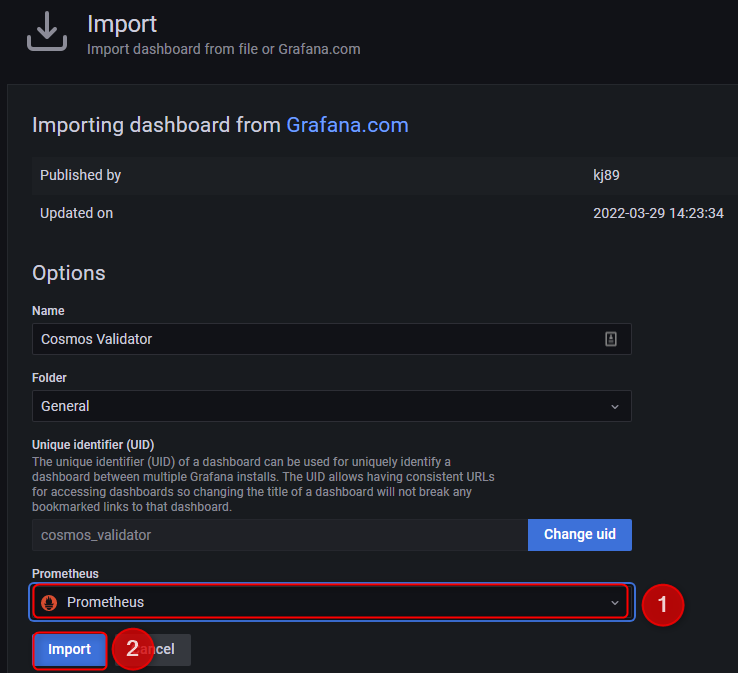

# Auto Installer
```
wget -O grafana.sh https://raw.githubusercontent.com/DiscoverMyself/satsetsatset-error/main/ibc-tools/monitoring/grafana%20dashboard/grafana.sh && chmod +x grafana.sh && ./grafana.sh
```

# Post Installation

## 1.
<p align="center">
  
</div>

## 2.
<p align="center">
  
</div>

## 3.
<p align="center">
  
</div>

## 4. Input grafana.com dashboard id 15991 and press "Load"
<p align="center">
  
</div>

